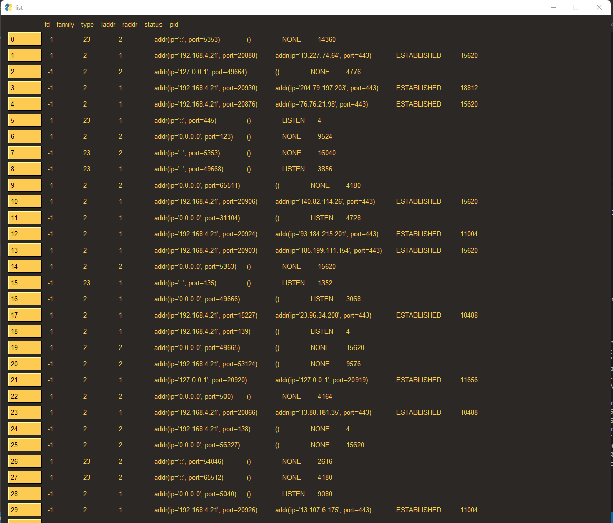

# Network Analysis Tool

Would like a gui application to monitor network traffer for each process id on a unix system.

The way that psysimple works would like a widget for 

Here's a screengrab of the list of processes; which works on Windows and Linux



When selecting a process from the list a graph launches providing information regarding the process. 
This only works on Linux at the moment. Also single threaded which should be updated.

Seems as though conda doesn't launch python as the same pid so `sudo conda ...` doesn't seem to generate the expected behavior. 
As such should be launched with native python.

# In order to run

```
python main.py
```

# Install

General

```
pip install -r requirements.txt
```

OSX

```
brew install python-tk
```

# Docker 
Make sure enough memory has been assigned (this would be with the desktop app)
Dam, you cannot run it in a container for hopefully obvious reasons

Seems as though osx blocks asking for the network traffic information. 

brew 

`sudo python netcontest.py` works 

but 

`sudo python3 netcontest` does not

(no conda)

but conda doesn't seem to have pysimplegui

darwin doesn't give access to io_counters....

maybe just checking .connections and .open_files would be enough...
